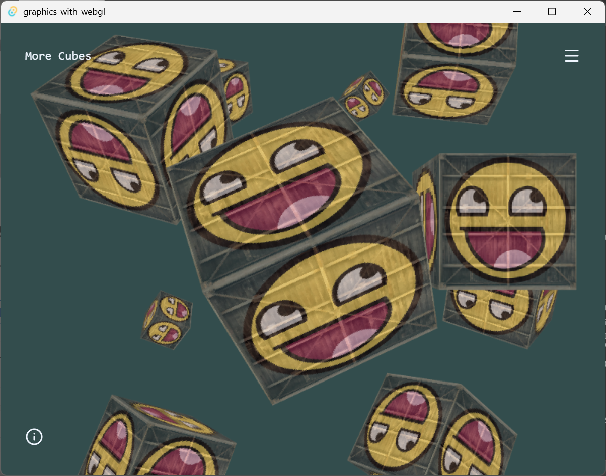

# Graphics with WebGL

This is an implementation of the demos in [Learn OpenGL](https://learnopengl.com) using
[JavaScript](https://developer.mozilla.org/en-US/docs/Web/JavaScript) (more specifically [TypeScript](https://www.typescriptlang.org/)) and [WebGL 2](https://developer.mozilla.org/en-US/docs/Web/API/WebGL_API#webgl_2).



This does not aim to be a one-for-one replication of the Learn OpenGL repository just in JavaScript. Instead, it is simply an attempt to learn graphics programming by going through the Learn OpenGL book.

> N/B: You can download a PDF version of the contents of Learn OpenGL [here](https://learnopengl.com/book)

I intend to go through the following parts of the book:

- Part I - Getting started (done)
- Part II - Lighting (done)
- Part III - Model Loading (done)
- Part IV - Advanced OpenGL (in progress)
- Part VIII - 2D Game ([done](graphics-with-webgl-svelte.vercel.app/2d-game/breakout))

## Dependencies

- [glMatrix](https://glmatrix.net/) - Fast Javascript matrix and vector math library
- [Assimpts](https://github.com/Fripe070/assimpts#readme) - For interfacing with the C++ [Assimp (*Ass*et *Imp*orter Library)](https://assimp.org/) (a library that handles importation of 3D models and supports many different file formats) in TypeScript
- [Svelte](https://svelte.dev/) and [SvelteKit](https://svelte.dev/docs/kit/introduction) - For state management, routing and navigation for the different scenes
- [Lucide (for Svelte)](https://lucide.dev/guide/packages/lucide-svelte) - For the few GUI icons used
- [TailwindCSS](https://tailwindcss.com/) - For styling
- [Tauri](https://v2.tauri.app/start/) - Here, it is simply used to package the web application into a native executable and run it in a native window. This makes the application more similar to Learn OpenGL (the demos are rendered in native windows).

## Running locally

This requires [pnpm](https://pnpm.io/) be installed on your system. Refer to the [installation instructions](https://pnpm.io/installation) if you don't have it.

You can optionally [install Rust](https://rust-lang.org/tools/install/) to run the application in a native window using Tauri.

Here are the steps:

1. Clone the repository
   ```bash
   git clone https://gitlab.com/learn-webgl-graphics-programming/graphics-with-webgl-svelte
   ```
   Alternatively, you can download the repository's code in a zip file from the GitLab (or GitHub) website and extract it to a location of your choice.
2. Install dependencies using pnpm
   ```bash
   pnpm install
   ```
3. Run the application using either:
   ```bash
   # For running the web application
   pnpm dev
   ```
   or:
   ```bash
    # To run the application in a native window
   pnpm tauri dev
   ```

### Recommended IDE Setup

[VS Code](https://code.visualstudio.com/) + [Svelte](https://marketplace.visualstudio.com/items?itemName=svelte.svelte-vscode) + (optionally) [Tauri](https://marketplace.visualstudio.com/items?itemName=tauri-apps.tauri-vscode) and [rust-analyzer](https://marketplace.visualstudio.com/items?itemName=rust-lang.rust-analyzer).

## Helpful Resources

- The [MDN articles on WebGL 2](https://developer.mozilla.org/en-US/docs/Web/API/WebGL_API#guides_and_tutorials)
- The [WebGL2 fundamentals](https://webgl2fundamentals.org/) website
- The MDN articles on the [Web Audio API](https://developer.mozilla.org/en-US/docs/Web/API/Web_Audio_API) (for the [game](graphics-with-webgl-svelte.vercel.app/2d-game/breakout))
- [DevDocs](https://devdocs.io), for helping me access the information from the above resources (and more) while offline
